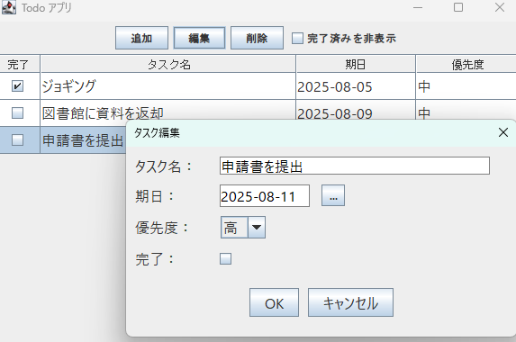

# Java GUI ToDo App 📝

これは、Java Swing を使用して作成されたシンプルな GUI ベースの ToDo アプリケーションです。

## 📸 スクリーンショット



---

## 🚀 特徴

- ✅ タスクの追加・編集・削除
- 📅 締切日（DatePicker）付きのタスク管理
- ⭐ 優先度（High / Medium / Low）指定
- 🔍 「完了タスクの非表示」チェック機能
- 💾 CSVファイルへの保存／読み込み

---

## 🧱 アーキテクチャ

**MVCパターン** に基づいて構築：

```
todo-gui-app/
├── controller/
│   └── TodoAppController.java
├── model/
│   ├── Task.java
│   ├── TaskManager.java
│   ├── TaskTableModel.java
│   └── Priority.java
├── view/
│   ├── TaskEditorDialog.java
│   └── TodoAppGUI.java
```

---

## 🛠️ 開発環境

- Java 17+
- Maven（任意）
- IntelliJ IDEA（推奨）
- [LGoodDatePicker](https://github.com/LGoodDatePicker/LGoodDatePicker) 使用

---

## 📦 ビルドと実行方法

```bash
# コンパイルと実行（IntelliJ推奨）
mvn clean compile exec:java
```

または、`TodoAppGUI.java` を `main` クラスとして直接実行。

---

## 📄 ライセンス

MIT License

